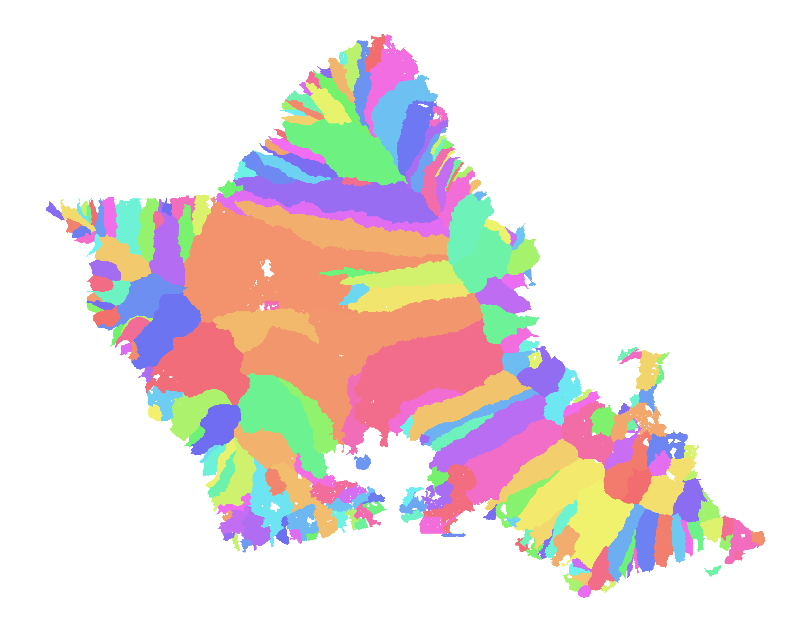

# Ahupuaʻa Watershed Mapper

An interactive map that overlays the traditional Hawaiian **ahupuaʻa** land
divisions on watersheds computed from a real digital elevation model, so you can
see where the old boundaries and the actual drainage agree and where they don't.

Ahupuaʻa are wedge-shaped divisions that run *mauka to makai* (mountain ridge to
reef). Each was meant to give a community a full slice of a watershed: upland
forest, taro land, and a piece of coast. That makes them a natural thing to test
against hydrology derived from elevation: if the idea holds, an ahupuaʻa should
line up with a single computed drainage basin. Often it does. Sometimes it doesn't, because the boundaries are cultural and
legal records rather than the output of a flow-routing algorithm. The map is
built to show both.

The first island processed is **Oʻahu**. The island is a single config variable,
so the same pipeline re-runs for Kauaʻi, Maui, or Hawaiʻi.



## What you're looking at

- **Terrain**: a hillshade of the USGS 10 m DEM.
- **Computed basins**: each colour is one watershed draining to a single stretch
  of coast, labelled by pointer-jumping the D8 receiver graph to its outlet.
- **Stream network**: cells whose upstream drainage exceeds a threshold; line
  weight grows with accumulation so trunk channels read as rivers.
- **Ahupuaʻa boundaries**: the cultural divisions, drawn as a light line over a
  dark halo so they stay legible over any layer, at any opacity.

## Using the map

- **Terrain / Match views.** Terrain shows the hillshade, basins and streams.
  **Match** recolours every ahupuaʻa by how well its boundary matches a single
  computed watershed: green = one watershed fills it, yellow = a dominant basin
  plus others, red = the drainage splits across several. This puts the central
  question on screen directly.
- **Hover** for the name (ʻokina and macrons intact), moku, acreage, and the
  match statistic. **Click** to pin an ahupuaʻa and overlay *its* computed
  watershed basin(s) directly on its boundary, so the agreement or divergence for
  that one division is visible at a glance.
- **Layer toggles + opacity**, a **scale bar**, a **north arrow**, and **moku
  labels** for orientation.
- **Search** an ahupuaʻa by name (diacritic-insensitive) to pin it, and
  **Show biggest mismatches** to highlight the handful of divisions whose
  boundaries diverge most from the computed drainage.
- **Island switcher.** The pipeline is island-parameterized; the switcher lists
  Oʻahu / Kauaʻi / Maui / Hawaiʻi and marks which have been processed. Only
  **Oʻahu** ships processed here. Run the pipeline with `ISLAND` set to another
  island to enable it (see below).

## Data sources

Both are discovered and verified live by `scripts/discover_source.py`. No URL is
hardcoded without a HEAD check first.

- **Ahupuaʻa boundaries**: State of Hawaiʻi Statewide GIS Program, *HistoricCultural*
  service, layer 1 (Ahupuaa). Sourced from OHA (2009) with DLNR/SHPD corrections.
  `https://geodata.hawaii.gov/arcgis/rest/services/HistoricCultural/MapServer/1`
  Attributes used: `ahupuaa` (name), `moku` (district), `mokupuni` (island).
  98 ahupuaʻa on Oʻahu.
- **Elevation**: USGS 3DEP 1/3 arc-second (~10 m) staged GeoTIFFs on the TNM S3
  bucket. The tiles covering the island are derived from the boundary layer's own
  extent (for Oʻahu: `n22w158`, `n22w159`).
  `https://prd-tnm.s3.amazonaws.com/StagedProducts/Elevation/13/TIFF/current/`

## Method (flow routing)

1. **Align**: reproject the DEM and boundaries to the island's UTM zone (Oʻahu:
   EPSG:32604, UTM 4N) at 10 m, so raster and vector share one metric grid.
2. **Mask the ocean**: 3DEP encodes water as both a nodata value and sea-level
   (0 m) flats. Both are masked so flow exits at the coastline instead of ponding
   on a giant flat.
3. **Condition**: fill pits, fill depressions, resolve flats (pysheds), so water
   can't get trapped in the DEM's imperfections.
4. **Route**: D8 flow direction, then flow accumulation (upstream cell count).
5. **Streams**: threshold accumulation at 5000 cells (~0.5 km²) and vectorize the
   network into LineStrings.
6. **Basins**: build the D8 receiver graph and path-double each land cell to the
   coastal outlet it drains to; each distinct outlet is a basin.
7. **Compare**: rasterize each ahupuaʻa and cross-tabulate its land cells against
   the basins, reporting the fraction in its single largest basin (`dom_frac`) and
   how many basins it spans.

Flow routing uses **pysheds** (numba-accelerated D8). If pysheds were unavailable,
the D8 direction + accumulation would be implemented directly in numpy; the basin
labelling here already is (see `delineate_basins` in `scripts/flow.py`).

## Running it end to end

Requires Python with `geopandas rasterio shapely numpy scipy requests pillow pysheds`
(conda-forge is the reliable route for the GDAL stack).

```bash
python scripts/discover_source.py   # verify both sources
python scripts/download.py          # download + align (resumable)
python scripts/flow.py              # condition, route, streams, basins
python scripts/export_web.py        # export the web payload
python scripts/verify_web.py        # hover hit-test + overlay check

cd ../.. && python -m http.server   # open http://localhost:8000/ahupuaa-watersheds/
```

Every download and the flow computation are **resumable**: each step skips work
whose output already exists and DEM downloads resume partial files with HTTP Range,
so an interrupted overnight run restarts cleanly.

### Re-running for another island

Set `ISLAND` in `scripts/config.py` to one of `Kauaʻi`, `Molokaʻi`, `Lānaʻi`,
`Maui`, `Hawaiʻi` (the UTM zone per island is already there) and re-run the five
scripts. Outputs are namespaced by island, so islands don't overwrite each other.
Hawaiʻi island is large enough at 10 m (~100M+ cells) that the flow step may need
tiling; Oʻahu and the smaller islands fit in memory as-is.

## Limitations

- **DEM resolution.** 10 m resolves main valleys well but not every small
  gully; sub-0.5 km² drainages are below the stream threshold by design.
- **Threshold sensitivity.** The stream network and the "how many basins" counts
  shift with `STREAM_THRESHOLD_CELLS`. 5000 cells (~0.5 km²) is a reasonable
  middle; lower it for a denser network, raise it for only major rivers.
- **Coastline basins.** On a 10 m coast, thousands of single-cell strips drain
  straight to sea and count as their own tiny basins; only basins ≥ 0.5 km² are
  drawn and used in the comparison. The full count is reported in QA.md.
- **Ahupuaʻa are not hydrology.** They are cultural and legal boundaries recorded
  and corrected over more than a century. Where an ahupuaʻa spans several computed
  basins, that reflects history, land use, and survey, not an error. The map is
  a lens on that relationship, not a scorecard for either layer.
- **Boundary vintage.** The GIS layer is one authoritative rendering of the
  ahupuaʻa; some boundaries are debated or approximate in the source data.

See `QA.md` for the verification results behind each stage.
