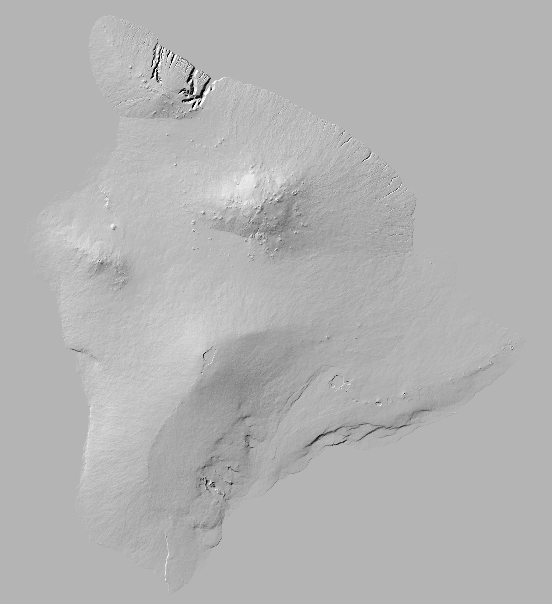

# Lava Flow History of Hawaiʻi Island

An interactive, time-animated map of every recorded lava flow on the Island of
Hawaiʻi, draped over a real USGS elevation hillshade. Drag the slider (or press
play) to watch flows erupt in chronological order — from ~700,000-year-old
Kohala shields to the 2022 Mauna Loa eruption — each younger flow burying the
older ground it covered, exactly as it did in the field.

The front end is vanilla JavaScript on a `<canvas>` (no Leaflet/Mapbox, no build
step). The processing is plain Python (geopandas / rasterio / shapely / numpy /
scipy / pillow).



## Why it matters

Hawaiʻi Island is built almost entirely of overlapping lava flows. Reading a
static geologic map, it is hard to see *time*: which ground is fresh, which is
ancient, and how the active volcanoes have paved the island over and over. By
rasterizing the flows into a single "youngest flow wins" surface and animating
the reveal, the map turns the geologic map into a legible history of resurfacing.

## Data sources

| Layer | Source | What we use |
| --- | --- | --- |
| Flow polygons + ages | **USGS DS-144 / I-2524A**, *Digital Database of the Geologic Map of the Island of Hawaiʻi* (Wolfe & Morris; digital database by F.A. Trusdell). `https://pubs.usgs.gov/ds/2005/144/` → `bimp.zip` | polygon geology coverage `bimpgeo` (EPSG:26905), attributes `YEAR1`/`YEAR2`, `UNITS`/`LABEL` |
| Recent flows (post-2003) | four USGS ScienceBase data releases: **June 27th flow 2014–2016** (`5cdd9871…`), **Puʻuʻōʻō episode 61g 2016–2017** (`597230e4…`), **2018 lower East Rift Zone** (doi:10.5066/P9S7UQKQ, `5eba3f60…`), **Mauna Loa 2022** (doi:10.5066/P1KES7F4, `666a1d25…`) | each eruption's final cumulative flow footprint, stamped with its year (2016/2017/2018/2022) |
| Elevation | **USGS 3DEP 1 arc-second** DEM, tiles `n19–n21 / w155–w157` | island hillshade |

All URLs were fetched and verified before use (see `scripts/config.py`).

### The age field, and how ages were normalized

The DS-144 polygons carry two numeric fields, `YEAR1` and `YEAR2`, plus a
map-unit code (`UNITS`, the map's `PTYPE`, e.g. `211` = `k3`).

* **Historically dated flows** (Mauna Loa & Kīlauea, A.D. 1790–1984) have a real
  calendar year in `YEAR1` (and `YEAR2` for multi-year eruptions). We use it
  directly. Example: the 1984 Mauna Loa flow → `1984`.
* **Prehistoric flows** have `YEAR1 = YEAR2 = -99999` and are dated only by their
  map unit, whose age is a **range in radiocarbon years before present** given in
  the map explanation (e.g. `k3` = "750–1,500 yr B.P."). We keep **both**:
  * a numeric **sort key** — the range midpoint converted to a calendar year
    (`year_sort = 1950 − midpoint_BP`), used for ordering and the timeline; and
  * the **original range label** — shown verbatim on hover and in the legend.

The full unit-code → age table lives in `scripts/config.py` (`PTYPE_AGE`),
transcribed from the DS-144 / I-2524A map explanation. Only **lava-flow** deposit
types are mapped; cones, tephra, and surficial units are excluded.

Each recent eruption (`config.py:RECENT_SOURCES`) is added as a single polygon —
its final cumulative flow footprint — at its calendar year: the 2014–2016 June
27th flow (`2016`), the 2016–2017 Puʻuʻōʻō episode 61g (`2017`), the 2018 Kīlauea
lower East Rift Zone (`2018`), and the 2022 Mauna Loa Northeast Rift Zone flow
(`2022`). Where a recent flow overlaps older mapped lava, the recent flow wins.

## How the pixels are built

* **Hillshade** — from the mosaicked DEM reprojected to EPSG:26905 (NAD83 / UTM
  5N) at **75 m/pixel**; standard illumination **azimuth 315°, altitude 45°,
  z-factor 1**. Saved as a grayscale PNG.
* **Flow-age raster** — the flow polygons rasterized onto the *same* grid, each
  pixel taking the eruption year of the **youngest** flow covering it (polygons
  burned oldest-first so younger flows overwrite older ones). Nodata where no
  recorded flow.
* **Web payload** — distinct years are ranked oldest→youngest into an *ordinal
  timeline*; the browser thresholds on that ordinal. `flow_age.png` encodes the
  ordinal in its **R/G** channels, the **source volcano** (1=Kīlauea … 5=Kohala)
  in **B**, and marks lava in **alpha**. Each pixel is tinted with a warm
  "cooling lava" ramp keyed to **log-age** (oldest dark red → youngest bright
  yellow). `timeline.json` maps each ordinal to its year, label, era, colour and
  area, and also carries the colour-bar ticks, the narrative eras, the landmark
  eruptions, and the five volcanoes' colours.

Because the arc→polygon (PAL) layer of the ArcInfo coverage cannot be assembled
by GDAL in bounded time, the polygons are rebuilt from the coverage's arcs
(`polygonize(ARC)`) and tagged with the attributes of the label point (`LAB`)
inside each face — the same topology the coverage encodes. ~99.5% of faces match
a label; unlabelled ocean/sliver faces are dropped.

## Using the map

The whole thing lives in one screen — no scrolling to reach the controls.

* **Play / slider** — sweep the timeline. Playback is *nonlinear*: it moves fast
  through the hundreds-of-thousands-of-years shield buildup and slows down through
  the historic era (A.D. 1790–2022) so the famous flows get screen time, pausing a
  beat on each landmark. **Speed** (0.5–4×) and **Loop** are next to Play.
* **Reading it** — the caption names the era you’re watching ("Building the
  shields…", "Historic era…"); the readout gives a monotonic frontier ("Revealed
  to A.D. 1979") and the running **km² resurfaced**. Nothing ever un-erupts.
* **Age ↔ Volcano** (top-right) — the default **Age** view uses the cooling-lava
  ramp with a labelled colour bar; **Volcano** recolours every flow by its source
  shield so the five volcanoes that built the island stand out.
* **Hover** any flow for its volcano, rock unit, and year or age.
* **Jump** to "Historic era", "Last 1,000 yrs", or "All time"; click a **landmark**
  chip (1790 Kīlauea, 1800 Hualālai, 1859/1935/1984 Mauna Loa, 2018 Kīlauea LERZ,
  2022 Mauna Loa) to snap there and spotlight that flow.
* **Deep links** — the URL hash carries view state, e.g. `#mode=volcano&lm=1984`.

## Run it end to end

Dependencies (conda-forge recommended for the GDAL stack):

```
conda install -c conda-forge geopandas rasterio shapely numpy scipy pillow requests
```

Then, from the repo root:

```
python scripts/discover_source.py   # Phase 0: verify sources          (GATE 0)
python scripts/download.py          # Phase 1: download + reproject     (GATE 1)
python scripts/build_rasters.py     # Phase 2: hillshade + flow-age      (GATE 2)
python scripts/export_web.py        # Phase 3: browser payload           (GATE 3)
cd ../.. && python -m http.server 8137   # open http://localhost:8137/lava-flow-history/
```

Every step is **resumable**: downloads and generated files that already exist are
skipped, so an interrupted overnight run restarts cleanly. Each script ends by
printing `VERIFICATION: phase N` and asserting its gate.

## Limitations (honest)

* **Recency.** DS-144 was compiled ~2000–2005, so its own dated flows end ~2003.
  Four later USGS data releases are merged in on top (2014–2016 June 27th flow,
  2016–2017 Puʻuʻōʻō ep 61g, 2018 Kīlauea LERZ, 2022 Mauna Loa). Still **not**
  included are the small **Kīlauea summit (Halemaʻumaʻu) crater eruptions of
  2020–2024** — they are largely confined to the caldera floor and a few pixels
  at this scale — and any 2018–2022 Puʻuʻōʻō/summit activity without a published
  footprint release. Adding one is a single entry in `config.RECENT_SOURCES`.
* **Prehistoric ages are ranges, not dates.** The midpoint sort key is a
  convenience for ordering; a "750–1,500 yr B.P." flow is not really one year.
  The original range is always shown so the uncertainty is visible.
* **The slider is ordinal, not linear in time.** Distinct ages are evenly
  spaced *steps*; the ~700,000-year prehistoric span is compressed so the
  historically dense last few centuries remain watchable. (Colour, separately,
  maps to **log-age** — see below — so the two axes disagree on purpose.)
* **Vents excluded.** Only lava-flow units are mapped, so spatter/tuff cones
  appear as small holes within their flow fields.
* **Rasterization.** Flows are burned at 75 m/pixel without `all_touched`, so
  flows or slivers narrower than a pixel can be missed; the flow-age surface is a
  faithful *area* map, not a source for precise boundaries.
* **Colour maps to log-age**, so equal colour steps are equal *factors* of age
  (an 8-year-old flow and a 700,000-year-old shield differ by ~5 log decades).
  This keeps both the historic flows and the prehistoric eras distinguishable,
  but it means colour is deliberately non-linear in years.

## Repository layout

```
scripts/    discover_source, download, build_rasters, export_web, config, fetch
data/       raw downloads              (gitignored)
processed/  intermediate rasters/gpkg  (gitignored)
QA.md       verification notes + histograms

../../lava-flow-history/       the canvas front end
../../data/lava-flow-history/  the committed browser payload this pipeline writes
```

Data credit: USGS DS-144 geologic map of the Island of Hawaiʻi (Wolfe & Morris;
Trusdell); USGS flow data releases 2014–2022 (June 27th flow, Puʻuʻōʻō episode
61g, 2018 lower East Rift Zone, 2022 Mauna Loa); and USGS 3DEP elevation.
