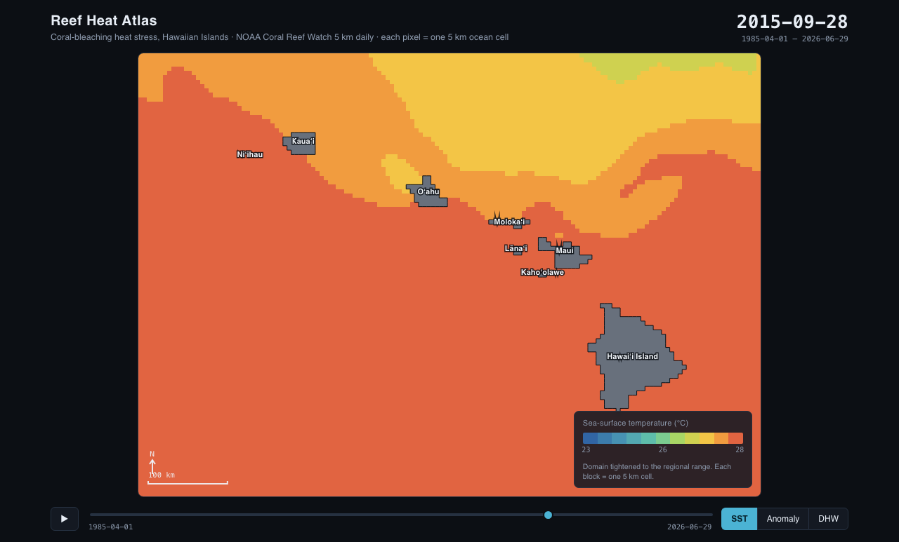
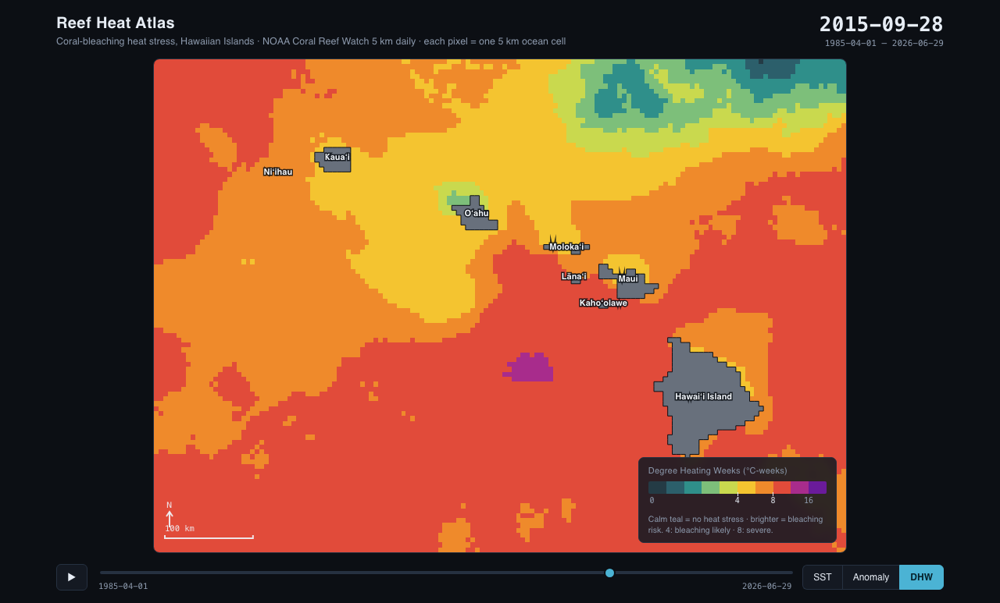
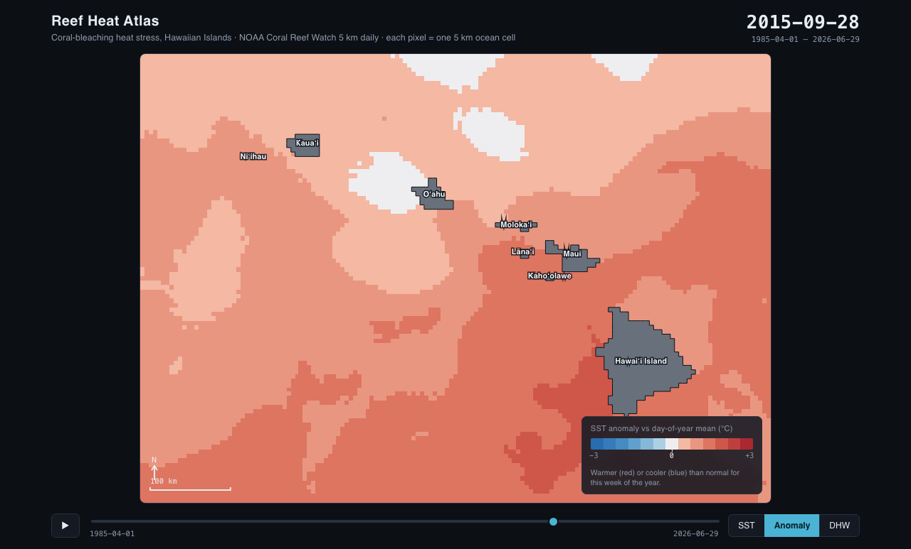

# Reef Heat Atlas

An interactive map of sea-surface temperature (SST) and coral-bleaching heat
stress around the Hawaiian Islands, built from NOAA Coral Reef Watch satellite
data. Scrub four decades of daily observations, toggle between raw temperature
and accumulated heat stress (Degree Heating Weeks), and read the exact value at
any reef cell.

The front end is vanilla JavaScript on a `<canvas>`, with no map library and no
build step. The processing is a handful of dependency-light Python scripts.

| Sea-surface temperature | Bleaching heat stress (DHW), Sept 2015 |
|---|---|
|  |  |

Every 5 km cell is drawn as a flat, quantised colour block with hard edges, so
the data and the islands share one pixel look. A third layer shows
the SST **anomaly** (each pixel minus its own day-of-year mean), which strips the
seasonal cycle and reveals real spatial structure:



## Background

When ocean temperature stays above a reef's normal summer maximum for weeks, the
accumulated heat drives corals to expel their symbiotic algae and bleach. NOAA
Coral Reef Watch quantifies that accumulated stress as **Degree Heating Weeks
(DHW)**. DHW ≥ 4 °C-weeks means significant bleaching is likely; DHW ≥ 8 means
severe bleaching and mortality are likely. Hawaiʻi saw major bleaching in 2014,
2015, and 2019, and all three events show up in this record.

## Data source

- **Product:** NOAA Coral Reef Watch **CoralTemp v3.1**, 5 km daily SST.
- **Server:** PacIOOS (University of Hawaii) ERDDAP, dataset `dhw_5km`
  (`https://pae-paha.pacioos.hawaii.edu/erddap/griddap/dhw_5km`). Discovered by
  probing the CoastWatch ERDDAP entry point
  `coastwatch.pfeg.noaa.gov/erddap/griddap/NOAA_DHW`, which redirects here.
- **Coverage used:** 1985-04-01 → present (the start of the CRW 5 km record).
- **Crop:** Hawaiian Islands, lat 18.0–23.0 N, lon 161.5–154.0 W. ERDDAP crops
  server-side, so we never download the globe. Grid is 101 × 151 at 0.05°.
- **Variables pulled:** `CRW_SST` (the full record) and `CRW_HOTSPOT` /
  `CRW_DHW` (a handful of days, for the MMM and cross-checks).

## The science

Per pixel:

- **MMM**, the Maximum Monthly Mean climatology: the warmest of the 12 monthly-mean
  SST values over CRW's baseline. We take CRW's **official** MMM directly:
  CRW publishes HotSpot *unclamped*, so `MMM = SST − HotSpot` recovers it exactly
  and identically on any day (verified time-invariant to 0.0000 °C). Baseline is
  therefore CRW v3.1's climatology (monthly means centred on 1985–2012/1988.2857),
  not a baseline we re-derived.
- **HotSpot** = `max(0, SST − MMM)`.
- **DHW** = sum over the trailing 84 days (12 weeks) of HotSpots ≥ 1.0 °C,
  divided by 7. Units: °C-weeks.
- **Risk thresholds:** DHW ≥ 4 (significant), DHW ≥ 8 (severe), as CRW defines.

DHW is computed on the daily series with a date-aware rolling 84-day window
(robust to occasional missing days), keeping memory bounded. The full 40-year
daily stack is never held in RAM at once.

**Validation:** our DHW is cross-checked against CRW's published `CRW_DHW` on
spot dates (see [QA.md](QA.md)); they agree to well under 1 °C-week RMSE.

## Run it end to end

```bash
# 1. Environment (conda-forge handles the netCDF4/HDF5 stack cleanly)
conda create -n reef -c conda-forge python=3.12 xarray netCDF4 numpy requests
conda activate reef

# 2. Discover and verify the endpoint, fetch one day
python scripts/discover_source.py

# 3. Bulk download the daily SST record, one file per year
#    Resumable: re-running skips years already on disk.
python scripts/download.py

# 4. Compute MMM, HotSpot, DHW; write weekly grids + metadata
python scripts/compute_dhw.py

# 5. Cross-check our DHW against CRW's published DHW
python scripts/verify_crw.py

# 6. Pack the compact browser payload
python scripts/build_web.py

# 7. Confirm the payload decodes to the same numbers the app shows
python scripts/verify_web.py

# 8. Serve the whole atlas and open the map
cd ../.. && python -m http.server 8000
# open http://localhost:8000/reef-heat-atlas/
```

Of the dependency set the project is allowed (xarray, netCDF4, numpy, scipy,
requests, pillow), only the first four are used: the browser colours the grids
itself, so there is no server-side image rendering (no pillow) and the DHW math
is plain numpy (no scipy).

Every step is resumable: downloads skip existing valid files, and compute/build
skip when their output already exists. An interrupted overnight run picks up
where it left off. Downloads are atomic (`.part` → rename) so a crash never
leaves a truncated file that a later run mistakes for complete.

## Repository layout

```
scripts/               (this folder holds the pipeline)
  config.py            # all config: endpoint, years, bbox, thresholds, paths
  common.py            # ERDDAP URLs, resumable/atomic download, sanity checks
  discover_source.py   # find & verify endpoint, one-day crop
  download.py          # bulk resumable SST download + MMM + gap report
  compute_dhw.py       # MMM/HotSpot/DHW, weekly grids + metadata
  verify_crw.py        # cross-check vs CRW published DHW
  build_web.py         # pack gzipped Int16/UInt8 grids + coastline + manifest
  verify_web.py        # payload decodes to the app's readout numbers
data/   processed/     # raw & derived NetCDF (gitignored, reproducible)
docs/                  # README screenshots
QA.md                  # verification evidence for each pipeline stage

../../reef-heat-atlas/       the canvas front end (index.html, app.js, style.css)
../../data/reef-heat-atlas/  the committed browser payload this pipeline writes
```

## Front end

Canvas-rendered, no dependencies. SST and DHW are shipped as gzipped scaled
integer grids (`sst.i16.gz`, `dhw.u8.gz`, ~9 MB together) plus a static water
mask and a coastline traced from the land mask; the browser inflates them with
the native `DecompressionStream` and colours them itself, so switching layers
is instant. Each cell is
painted as a flat quantised block (`imageSmoothingEnabled = false`, nearest-
neighbour upscaling) so the whole map reads as deliberate pixel art.

- **Three layers:** SST (domain tightened to the regional range), SST anomaly vs
  the per-pixel day-of-year mean (computed in the browser, diverging scale), and
  DHW (calm teal at zero, sensitive low end, 4/8 thresholds as discrete steps).
- **Stepped legends** that match the on-map colour steps exactly.
- **Play/scrub** time slider labelled with the full date range; large current date.
- **Orientation:** island labels, a 100 km scale bar, and a north arrow.
- **Hover readout:** SST, anomaly, DHW, and bleaching-risk class at the cursor's
  5 km cell.

`BLOCK` in `app.js` is an integer chunkiness knob: `1` = native 5 km cells (each
pixel = one cell); larger values bin cells into coarser display blocks.

## Limitations & trade-offs

- **Weekly web payload.** The browser data is downsampled to one frame per week
  (`WEB_STRIDE_DAYS` in `config.py`); gzipped it is ~9 MB. DHW is still
  computed daily; only the stored/displayed frames are weekly.
- **Lossy web quantisation.** SST is stored as Int16 at 0.05 °C; DHW as UInt8 at
  0.1 °C-week (ceiling 25 °C-weeks, ample for Hawaiʻi). The Python `processed/`
  NetCDF keeps full float precision.
- **Blocky coastline.** Island outlines are traced from the 5 km land mask, so
  they are pixelated at 5 km. That matches the data resolution, but it is not a
  cartographic coastline. A fuller version would overlay a vector shoreline.
  Isolated single-cell land specks (lone reef rocks) are removed so they don't
  read as stray pixels; multi-cell islands are untouched.
- **Anomaly baseline.** The anomaly layer subtracts each pixel's mean SST for the
  matching week-of-year, computed in the browser from the loaded record itself.
  It shows departure from the local seasonal norm, not a fixed external baseline.
- **Cloud gaps.** A pixel with no SST on a given day contributes zero HotSpot
  that day (as CRW effectively does); the SST layer shows such cells as "no
  data". Persistent cloud can mildly under-count DHW.
- **Current year is partial.** The most recent year file stops at the dataset's
  latest day; delete it and re-run `download.py` to refresh.
- **What a fuller version would add:** deeper zoom with true vector coastlines,
  per-reef time-series charts, anomaly overlays, and the CRW Bleaching Alert Area
  categories alongside DHW.
